> **openpi 的 data pipeline 有两条路径（训练 / 推理），但复用同一条 transform 链。**
> 训练用 `.inputs` 单向跑、loss 在归一化空间算；推理 `.inputs` + `.outputs` 镜像走回，把动作反归一化成真实物理单位。
> 粘合两端的是 `norm_stats.json`——训练时算、存进 checkpoint、推理时读，保证两端分布完全一致。

**本笔记包括：**

- **§1 · §2 — 全景 + 概念**：先一张 Mermaid 流程图把训练数据流看完；再从零讲 transform / transform 链的本质（给完全没接触过的人）
- **§3 · §4 — 源码拼装 + 逐层细节**：`transform_dataset()` 里 4 组配置怎么 `*` 展开成 8 个 transform；每层"做什么 + 为什么"逐个讲
- **§5 · §6 — 推理路径**：推理是训练的"镜像"——输入链相同、输出链反向；训练 vs 推理对照表
- **§7 · §8 · §9 — 执行机制 + 设计哲学 + 性能**：pipeline 是 lazy 的（构造 ≠ 执行）；三大设计决策（Adapter / Mirror / Glue）；RTX GPU 上的延迟拆分
- **§10 · §11 — 落地 + 总结**：换自己的数据集只需改 4 处；一句话收尾

**适合谁读**：想弄懂 openpi（pi0 / pi0.5）数据流的人；更具体地——看懂源码里 `LeRobotLiberoDataConfig.create()`、`transform_dataset()`、`Policy.infer()` 三段关键代码的含义。

---

## 1. 训练路径总览

先看全局——下面这张图就是从磁盘上一条原始 LeRobot 数据到 `model.forward()` 算出 loss 的完整流程。图里每个节点都是后面要讲的一个具体 transform：

```mermaid
flowchart TB
    T0["<b>LeRobotDataset</b><br/><span style='font-size:11px'>parquet + PNG · 原始数据</span>"]:::source
    T1["<b>RepackTransform</b><br/><span style='font-size:11px'>键名重映射（训练独占）<br/>image → observation/image</span>"]
    T2["<b>LiberoInputs</b><br/><span style='font-size:11px'>数据集适配器 · 打包 state/image/prompt<br/>右腕补零 + mask · PNG → uint8 HWC</span>"]:::adapter
    T3{"<b>extra_delta_transform?</b><br/>pi0=是 · pi0.5=否"}
    T4["<b>DeltaActions</b><br/><span style='font-size:11px'>actions -= state<br/>绝对动作 → 相对动作</span>"]
    T5["<b>Normalize</b> ★<br/><span style='font-size:11px'>z-score 或 quantile<br/>用 norm_stats.json</span>"]:::glue
    T6["<b>InjectDefaultPrompt</b><br/><span style='font-size:11px'>兜底（训练通常不触发）</span>"]
    T7["<b>ResizeImages</b><br/><span style='font-size:11px'>224×224 · resize_with_pad</span>"]
    T8["<b>TokenizePrompt</b><br/><span style='font-size:11px'>PaliGemma tokenizer<br/>pi0.5: 加 state tokens</span>"]
    T9["<b>PadStatesAndActions</b><br/><span style='font-size:11px'>7 → 32 维（action_dim）</span>"]
    T10["<b>DataLoader collate</b><br/><span style='font-size:11px'>per-sample → batch</span>"]
    T11["<b>model.forward</b><br/><span style='font-size:11px'>→ Flow Matching loss</span>"]:::terminal

    T0 --> T1 --> T2 --> T3
    T3 -- "是" --> T4 --> T5
    T3 -- "否" --> T5
    T5 --> T6 --> T7 --> T8 --> T9 --> T10 --> T11

    classDef source fill:#1e3a2e,stroke:#4ade9a,stroke-width:2px,color:#e8e6e0
    classDef adapter fill:#2a1e3d,stroke:#a78bfa,stroke-width:2px,color:#e8e6e0
    classDef glue fill:#3d2a1e,stroke:#f59e0b,stroke-width:2px,color:#e8e6e0
    classDef terminal fill:#1e2a3d,stroke:#60a5fa,stroke-width:2px,color:#e8e6e0
```



图例：🟢 数据源 · 🟣 数据集适配层 · 🟠 分布对齐（胶水） · 🔵 终点（模型）。

训练 / 推理共用的锚点是 `LeRobotLiberoDataConfig.create()`——两边都从这里派生 `data_transforms.inputs`，所以模型看到的 tensor 格式完全一致。

**怎么读后面几节**：

- 对图里这些名字（`LiberoInputs`, `Normalize`, ...）还没概念？看 §2 先建立"transform / transform 链"的直觉
- 想知道这 8 个 transform 在源码里是怎么拼出来的？看 §3
- 想知道每个 transform 具体做什么、为什么？看 §4

---

## 2. transform 链是什么 · 以及为什么值得单独看

### 2.1 transform 是什么

在 openpi 里，一个 **transform** 就是这样一个无状态函数：

```python
class SomeTransform:
    def __call__(self, data: dict) -> dict:
        # 读 data 里的几个键，做点事，返回新的 dict
        ...
```

**输入一个嵌套 dict、输出一个嵌套 dict**——就这么简单。它不持有 state（构造时传入的配置除外），不跟数据库/文件交互，纯粹是"字典进、字典出"的函数。

几个具体例子：

| Transform | 输入 dict 里有 | 输出 dict 里有 |
| --- | --- | --- |
| `RepackTransform` | `image, wrist_image, state, actions` | `observation/image, observation/wrist_image, observation/state, actions` |
| `ResizeImages` | `image:(256,256,3)` | `image:(224,224,3)` |
| `Normalize` | `state:(8,), actions:(10,7)` 原始值 | `state, actions` 归一化后的值 |
| `TokenizePrompt` | `prompt: "pick up the cup"` | 上述键 + `tokenized_prompt:(48,), tokenized_prompt_mask:(48,)` |

每个 transform 只管**一件**小事。

### 2.2 "链"就是把一串 transform 串起来

"transform 链" = 把 N 个 transform 按顺序**依次调用**，前一个的输出 dict 喂给下一个：

```python
def run_chain(data: dict, transforms: list) -> dict:
    for t in transforms:
        data = t(data)
    return data
```

伪代码演示 LIBERO 的完整数据流（对应 §1 那张图的每个节点）：

```python
data = LeRobotDataset[i]                       # 磁盘上一帧原始数据
data = RepackTransform()(data)                 # 键名重映射
data = LiberoInputs()(data)                    # 打包图像/state/prompt
data = DeltaActions(mask)(data)                # 动作变相对（可选）
data = Normalize(norm_stats)(data)             # 归一化
data = InjectDefaultPrompt("...")(data)        # 兜底 prompt
data = ResizeImages(224, 224)(data)            # 图像缩放
data = TokenizePrompt(tokenizer)(data)         # 文本 → token
data = PadStatesAndActions(32)(data)           # 维度补零
# → 现在 data 是 pi0 模型期望的"规范输入"
```

真实代码里这是一个 `list` 用 `for t in transforms: data = t(data)` 一口气跑完（见 §7）。

### 2.3 为什么值得单独看 transform 设计

pi0 模型本身只认识一种"规范输入"：嵌套 dict，包含 `state / image{base,left_wrist,right_wrist} / image_mask / prompt tokens / actions`。但现实里每个数据集字段五花八门：

- **LIBERO**：仿真 Robosuite，7 DoF，2 相机（无右腕），state 直接透传
- **ALOHA**：真机双臂，14 DoF，4 相机全齐，state 要做 joint flip + gripper 几何变换
- **DROID**：真机单臂，8 DoF，2 相机（无右腕），state 要 concat `joint_position + gripper_position`

如果每个数据集都直接改模型输入格式，模型就没法共享权重。openpi 的解法：**把"适配"这件事完全抽到 transform 层**，模型永远只看规范格式。同一个 `PI0Pytorch` 既能在 LIBERO 上微调，也能在 ALOHA / DROID 上微调，甚至可以联合训练。

transform 链就是那条"把各种原始数据 → 模型规范输入"的胶水。

---

## 3. 源码视角：从 4 组配置到 8 个 transform

### 3.1 源码里是怎么写的

`transform_dataset()` 里组装 transform 链只有四行（用 `*` 展开 + 单独插入 Normalize）：

```python
return TransformedDataset(
    dataset,
    [
        *data_config.repack_transforms.inputs,
        *data_config.data_transforms.inputs,
        _transforms.Normalize(norm_stats, use_quantiles=data_config.use_quantile_norm),
        *data_config.model_transforms.inputs,
    ],
)
```

这四组分别是：

| 组 | 来源 | 里面装着什么 |
| --- | --- | --- |
| `repack_transforms.inputs` | `LeRobotLiberoDataConfig.repack_transforms` | `RepackTransform`（键名重映射） |
| `data_transforms.inputs` | `LeRobotLiberoDataConfig.create()` 里组装 | `LiberoInputs`（数据集适配器）+ 可选 `DeltaActions` |
| `Normalize(...)` | 单独插入 | `Normalize`（唯一一个不在任何组里，因为要接 norm_stats） |
| `model_transforms.inputs` | `ModelTransformFactory()(model_config)` | `InjectDefaultPrompt` + `ResizeImages` + `TokenizePrompt` + `PadStatesAndActions` |

### 3.2 `*` 展开之后 · 真实执行顺序

上面四行用 `*` 展开，再把每一组拆开，就是下面这 8 个 transform 顺序执行（LIBERO + `extra_delta_transform=True` 场景）：

```python
return TransformedDataset(
    dataset,
    [
        RepackTransform({...}),                   # ← 来自 repack_transforms.inputs
        libero_policy.LiberoInputs(...),          # ★ 数据集适配器 ★  来自 data_transforms.inputs
        _transforms.DeltaActions(delta_action_mask),  # ← 可选，if extra_delta_transform
        _transforms.Normalize(norm_stats),        # ← 单独插入
        _transforms.InjectDefaultPrompt(...),     # ← 来自 model_transforms.inputs
        _transforms.ResizeImages(224, 224),       # ← 来自 model_transforms.inputs
        _transforms.TokenizePrompt(...),          # ← 来自 model_transforms.inputs
        _transforms.PadStatesAndActions(...),     # ← 来自 model_transforms.inputs
    ],
)
```

对应的 `LeRobotLiberoDataConfig.create()` 里，`data_transforms` 是这么拼起来的：

```python
data_transforms = _transforms.Group(
    inputs=[libero_policy.LiberoInputs(model_type=model_config.model_type)],
    outputs=[libero_policy.LiberoOutputs()],  # outputs 仅推理时用
)
if self.extra_delta_transform:
    data_transforms = data_transforms.push(
        inputs=[_transforms.DeltaActions(delta_action_mask)],
        outputs=[_transforms.AbsoluteActions(delta_action_mask)],
    )
model_transforms = ModelTransformFactory()(model_config)
```

注意几个设计点：

- **`Group(inputs, outputs)`** 是个容器——训练只用 `.inputs`；推理两边都用（输入链 + 镜像输出链）。
- **Normalize 为什么要单独插入**：因为 `norm_stats` 是运行时从 checkpoint 目录加载进来的，不属于任何静态配置组。
- **`DeltaActions` 是 push 进去的**：`push()` 会把新 transform 追加到现有 `inputs` 末尾 + `outputs` 开头（保证镜像对称——输入时先 Delta 再 Normalize，输出时先 Unnormalize 再 Absolute）。
- **`ModelTransformFactory` 按模型类型分支**：pi0 和 pi0.5 的区别就在这里（`TokenizePrompt(discrete_state_input=...)`）。

### 3.3 Loader 的 class 包裹关系

`TransformedDataset` 只是整个数据流里**最内圈**的一层——外面还套了好几层 Loader class，每层各管一件事：

```text
┌─────────────────────────────────────────────────────────┐
│ DataLoaderImpl          ← 最外层，暴露给训练代码         │
│   职责：保存 data_config，dict → (Observation, Actions)  │
│   ↓ 包含                                                 │
│   TorchDataLoader       ← openpi 自己的包装              │
│     职责：JAX / PyTorch 框架适配、无限循环、sharding     │
│     ↓ 包含                                               │
│     torch.utils.data.DataLoader  ← PyTorch 原生          │
│       职责：batch 生产线（sampler + collate_fn + worker）│
│       ↓ 读取                                             │
│       TransformedDataset  ← 数据集 + transform 链        │
│         职责：__getitem__ 时触发 transform 链执行        │
│         ↓ 读取                                           │
│         LeRobotDataset  ← 最底层                         │
│           职责：从磁盘读原始 parquet                     │
│                 delta_timestamps 把单帧 action 变成 chunk│
└─────────────────────────────────────────────────────────┘
```

**为什么拆成 5 层**：每层单一职责，外层面向业务、内层面向通用，可以单独替换。比如：

- 想换框架？只改 `TorchDataLoader` 这一层（其实 openpi 也有 JAX 版本）
- 想换数据源？只改 `LeRobotDataset`（换成你自己的 parquet / TFDS / mp4）
- 想加 / 删 transform？只改 `transform_dataset()` 里那个列表
- 想换 batch / 并行策略？只改 `torch.utils.data.DataLoader` 的参数

**从训练代码的视角看**：

```python
for observation, actions in loader:   # ← 这一行触发整条链
    loss = model(observation, actions)
```

`for ... in loader` 每次迭代 = **一次**完整的 5 层调用：

```text
DataLoaderImpl.__iter__
  ↓ 从下游拿 batch dict
  TorchDataLoader.__iter__
    ↓ 从下游拿 per-sample list
    torch DataLoader
      ↓ sampler 选 32 个 idx，worker 并行调 dataset[idx]
      TransformedDataset.__getitem__(i):
          data = LeRobotDataset[i]         # 读 parquet 行
          for t in self._transforms:       # ★ 这里才真跑 transform 链 ★
              data = t(data)
          return data
      ↓ 32 条样本 → collate_fn 堆成 batch
      torch DataLoader → batch dict
    ↓
    TorchDataLoader → batch dict
  ↓
  DataLoaderImpl → (Observation, actions)  ← 转成 dataclass 交给训练循环
```

这就是为什么**构造 transform 很便宜（只存配置），但训练一跑起来 transform 就是热路径**——每个 step 都要跑 batch_size × len(transforms) 次。30k steps × 32 batch × 7 transforms ≈ 670 万次调用。所以 `num_workers > 0` 多进程并行至关重要。

---

## 4. Transform 逐层展开

### 4.1 RepackTransform · 键名重映射

**做什么**：把 LeRobot 原始键（`image`, `wrist_image`, `state`, `actions`）改名成统一 schema（`observation/image`, `observation/wrist_image`, `observation/state`, `actions`）。

**为什么**：推理时客户端直接发送 `observation/image` 这类目标键名，训练时需要先把 LeRobot 格式"翻译"过来，好让后续所有 transform 都面向同一套 schema。**只训练时用，推理跳过**（客户端 element 已经是目标键名）。

---

### 4.2 LiberoInputs · 数据集特定适配

**做什么**：

1. PNG bytes → `uint8 HWC numpy`（从 CHW float 转回去，因为下游 vision encoder 期望 HWC uint8）
2. 组装嵌套 dict：

```python
{
    "state": state,                                    # (8,)
    "image": {
        "base_0_rgb": image,                           # (H, W, 3)
        "left_wrist_0_rgb": wrist_image,
        "right_wrist_0_rgb": np.zeros_like(image),     # 补零（LIBERO 没右腕）
    },
    "image_mask": {
        "base_0_rgb": np.True_,
        "left_wrist_0_rgb": np.True_,
        "right_wrist_0_rgb": np.False_,                # mask=False 让模型知道这图是假的
    },
    "actions": actions,    # 训练时才有
    "prompt": prompt,
}
```

**为什么**：这是**每个数据集都得重写一次的部分**。pi0 模型固定三相机接口，但 LIBERO 只有两相机——右腕补零 + mask=False，让 attention 层自动屏蔽掉这路输入，等效于"没图"。

**对照表**：不同数据集的 XxxInputs 差异：

| 维度 | **LIBERO** | **ALOHA** | **DROID** |
| --- | --- | --- | --- |
| DoF | 7 | 14 | 8 |
| 相机数 | 2（+1 零补齐） | 4（全齐） | 2（+1 零补齐） |
| State 构造 | 直接透传 | `_decode_aloha` | concat joint + gripper |
| Joint 翻转 | ❌ | ✅ | ❌ |
| Gripper 变换 | ❌ | ✅ 线性→角度几何变换 | ❌ |
| 按 model_type 分支 | 只影响右腕 mask | ❌ | ✅ 完全不同相机布局 |

**共同点**：所有 `XxxInputs.__call__` 输出**同一种嵌套结构**——这是适配器（Adapter）模式的精髓，模型架构可跨平台共享权重。

---

### 4.3 DeltaActions · 可选的相对动作变换

**做什么**：`actions[..., :dims] -= state[..., :dims]`，把绝对动作变相对动作。

**为什么**：控制变量是 `LeRobotLiberoDataConfig.extra_delta_transform`，主要是历史遗留问题：

| config | extra_delta | 说明 |
| --- | --- | --- |
| `pi0_libero` / `pi0_fast_libero` | True | LIBERO 动作本身已是相对，但为了和老 checkpoint 对齐，**再**做一次 delta |
| `pi05_libero` | **False** | pi0.5 不做这层，直接用 LIBERO 原生 delta action |

---

### 4.4 Normalize · 分布对齐的核心

**做什么**：对 `state` 和 `actions` 做归一化。pi0 用 z-score，pi0.5 / pi0-FAST 用 quantile。

**为什么**：这是整个 pipeline 的**灵魂**。同一份 `norm_stats.json` 串起训练-推理生命周期：

```text
训练时                   推理时（同一份 stats）
─────────────           ────────────────────────
compute_norm_stats.py   checkpoint/assets/norm_stats.json
扫全集算 mean/std       ─────────────────────────┐
  ↓                                               │
norm_stats.json                                   ▼
  ↓                                          Normalize(state, actions)
  存进 assets/                                ↓
  ↓                                          model.sample_actions
  Normalize(state, actions)                   ↓
  ↓                                          Unnormalize(actions)  ← 镜像反向
  训练 loss                                   ↓
                                             发回 client（真实单位）
```

**关键不变量**：norm_stats 从 checkpoint 目录读，保证**训练时模型看到的分布 = 推理时模型看到的分布**。

---

### 4.5 InjectDefaultPrompt · 兜底 prompt

**做什么**：如果 batch 里没有 `prompt` 键，注入一个默认值。

**为什么**：训练时通常不触发（LeRobot 数据集有 `task_index` → 自然语言 prompt）；推理时客户端没传 prompt 就用这个兜底，免得 tokenizer 崩。

---

### 4.6 ResizeImages · 统一到 224×224

**做什么**：所有相机图像用 `resize_with_pad` 缩到 224×224。`resize_with_pad` 保持长宽比 + 用边缘填充，不会扭曲画面。

**为什么**：SigLIP 固定输入 224×224。LIBERO 原始 256×256、DROID 真机可能任意分辨率，统一到这一层之后模型就不用关心原始分辨率了。

---

### 4.7 TokenizePrompt · 文本 → token id

**做什么**：用 PaliGemma tokenizer 把自然语言 prompt 转成 `tokenized_prompt: (max_token_len,)` + `tokenized_prompt_mask: (max_token_len,)`。

**pi0 vs pi0.5 的关键差异**：`discrete_state_input=True` 时还会把 state 离散化成 256-bin，拼进 prompt token 序列里。这是 pi0.5 "discrete state" 设计的实现位置。

---

### 4.8 PadStatesAndActions · 补零到模型维度

**做什么**：把 state / actions 最后一维补零到 `model.action_dim`（固定 32）。

**为什么**：pi0 模型的 action_dim 固定是 32，但不同机器人维度不同（LIBERO=7, ALOHA=14, DROID=8）。补零到 32 就能让所有数据集共用同一个模型头。推理时 `LiberoOutputs` 再切回前 7 维发给客户端。

---

## 5. 推理路径：训练的"镜像"

推理是一客户端 + 一服务端架构：

- **Server**（GPU 机器）：`serve_policy.py` + `WebsocketPolicyServer`，托管 policy，一次前向推理出 action chunk
- **Client**（仿真 / 真机机器）：每步发观测、收动作、step env

### 5.1 服务端组装：对称的双向 transforms

```python
# create_trained_policy 里的关键片段
return _policy.Policy(
    model,
    transforms=[                                  # ← 输入链（和训练一致）
        *repack_transforms.inputs,
        transforms.InjectDefaultPrompt(default_prompt),
        *data_config.data_transforms.inputs,      # LiberoInputs (+ DeltaActions if set)
        transforms.Normalize(norm_stats, ...),
        *data_config.model_transforms.inputs,     # Resize + Tokenize + Pad
    ],
    output_transforms=[                           # ← 输出链（逆序 + 反向操作）
        *data_config.model_transforms.outputs,    # 基本 no-op
        transforms.Unnormalize(norm_stats, ...),  # ← Normalize 的镜像
        *data_config.data_transforms.outputs,     # LiberoOutputs: 只取前 7 维
        *repack_transforms.outputs,
    ],
)
```

### 5.2 `Policy.infer()` 的 8 步

1. 拷贝 obs（防 transforms 原地改）
2. `self._input_transform(inputs)` — 跑完整输入链（和训练一样）
3. 加 batch 维：`x[np.newaxis, ...]`，**推理永远 batch=1**
4. （可选 noise）
5. `Observation.from_dict(inputs)` — dict → 结构化 dataclass
6. `self._sample_actions(...)` — 真正调模型（Flow Matching 10 步 Euler 去噪）
7. 去 batch 维 + 转回 numpy
8. `self._output_transform(outputs)` — 输出链（Unnormalize → LiberoOutputs 切回 7 维）

### 5.3 一次推理的维度流转

| 阶段 | 关键字段形状 |
| --- | --- |
| client element | `state:(8,)`, `image:(224,224,3)`, `wrist_image:(224,224,3)`, `prompt:str` |
| LiberoInputs 之后 | `image:{base, left_wrist, right_wrist:zeros}`, `image_mask:{..., right_wrist:False}` |
| Normalize 后 | state / actions 按 norm_stats 归一化 |
| TokenizePrompt 后 | 多一个 `tokenized_prompt:(max_token_len,)` |
| PadStatesAndActions 后 | `state:(32,)`（补零） |
| 加 batch 维 | 所有字段前 prepend `1` |
| model.sample_actions 输出 | `actions:(1, 10, 32)` |
| LiberoOutputs 切片 | `actions:(10, 7)` 发回客户端 |

---

## 6. 训练 vs 推理 · 对照表

| 阶段 | input transforms | output transforms | batch size | 为什么 |
| --- | --- | --- | --- | --- |
| **训练** | ✅ 用（处理 obs + action target） | ❌ **不用** | 256 | loss 在归一化空间算，没必要反归一化 |
| **推理** | ✅ 用（只有 obs） | ✅ **用**（反归一化回真实单位） | **1** | 机器人只认真实物理单位；单 client 单请求 |

**关键不变量**：同一套 transforms 代码 + 同一份 `norm_stats.json` → 保证训练分布 = 推理分布。

---

## 7. 构造 vs 执行 · Lazy Pipeline

`transform_dataset()` 返回的 list 里每个元素都是**已构造但未执行**的对象：

```python
Normalize(norm_stats, use_quantiles=...)
# 只调 __init__（保存配置），没做任何归一化计算
```

真正执行是在训练循环触发的：

```text
for obs, act in loader:
    ↓
dataset[i]（每个 batch 32 次）
    ↓
TransformedDataset.__getitem__(i):
    for t in transforms:
        data = t(data)   ← ★ 这里才真的执行每个 transform ★
```

**单次 for 迭代 ≈ 32 次 `__getitem__` ≈ 32 × 7 ≈ 224 次 `transform.__call__`**。训练 30k steps 就是 **670 万次** transform 调用——所以 `num_workers > 0` 多进程并行是性能关键。

---

## 8. 设计哲学 · 为什么这个 pipeline 优雅

三个核心设计决策：

1. **适配器模式（Adapter）**：每个 `XxxInputs` 是该数据集的适配器，把五花八门的数据集字段统一成 π₀ 模型期望的规范输入。**适配放在数据层，模型永远不动**。

2. **镜像对称（Mirror Symmetry）**：训练 `.inputs` 单向跑；推理 `.inputs` + `.outputs` 镜像走回。`Normalize ↔ Unnormalize`、`DeltaActions ↔ AbsoluteActions`、`LiberoInputs ↔ LiberoOutputs` 两两成对。

3. **norm_stats 是胶水（Glue）**：几 KB 的 JSON，训练时算、存进 checkpoint、推理时读。串起整个生命周期，保证两端同分布——**这是 pipeline 里最小但最关键的一环**。

换句话说：**模型开发和数据处理彻底解耦**。`PI0Pytorch` 不认识什么 LIBERO / ALOHA / DROID，它只认识一种规范输入；所有"脏活累活"都封在 transforms 里。`Policy` 类作为模型面向用户的包装，把 `model + input_transform + output_transform + norm_stats` 全封在 `infer(obs_dict) → action_dict` 一行 API 里，WebSocket 服务端完全不用懂模型细节——关注点分离做得极彻底。

---

## 9. 延迟拆分（RTX GPU · pi05_libero · LIBERO env）

```text
client_infer_ms       121.8 ms    客户端视角总延迟
server_infer_ms       120.4 ms    server 端处理（含 transforms + model + 打包）
policy_infer_ms        95.9 ms    纯 model.sample_actions（10 步去噪）
```

| 项目 | 值 | 占比 |
| --- | --- | --- |
| 网络 + msgpack | 1.4 ms | 1% |
| Server CPU（transforms + 打包） | 24.5 ms | 20% |
| 模型 forward（GPU） | 95.9 ms | **79%** |

**结论**：瓶颈在模型本身，不在 transforms。优化方向是减少 diffusion 步数 / 小模型 / 量化 / 更好 GPU，而非精简 pipeline。

---

## 10. 自己 fine-tune 要改的地方

按官方设计，换自己的数据集时**只改 4 处**，其余保持不动：

1. **数据转换脚本**：把原始数据写成 LeRobot 格式（参考 `convert_libero_data_to_lerobot.py`）
2. **自定义 `XxxInputs` / `XxxOutputs`**：键名映射 + 右腕相机有无
3. **自定义 `XxxDataConfig`**：配 RepackTransform 和 DeltaActions 开关
4. **新 TrainConfig 条目**：指定 model / data / base checkpoint / 训练步数

归一化统计量单独跑一次：

```bash
python scripts/compute_norm_stats.py --config-name=<your_config>
```

---

## 11. 一句话总结

> **openpi 的 data pipeline = 一条复用的 7 层 transform 链 + 两条镜像对称的路径 + 一份 norm_stats.json 粘合**。训练时 lazy 地逐 batch 跑 `.inputs` 喂模型算 loss；推理时走完 `.inputs`、模型出动作，再镜像走 `.outputs` 反归一化发回客户端。同一份 transforms 代码、同一份归一化统计量保证两端分布一致——这就是"训练多样数据集、部署多样平台"这件事能成立的工程基础。
